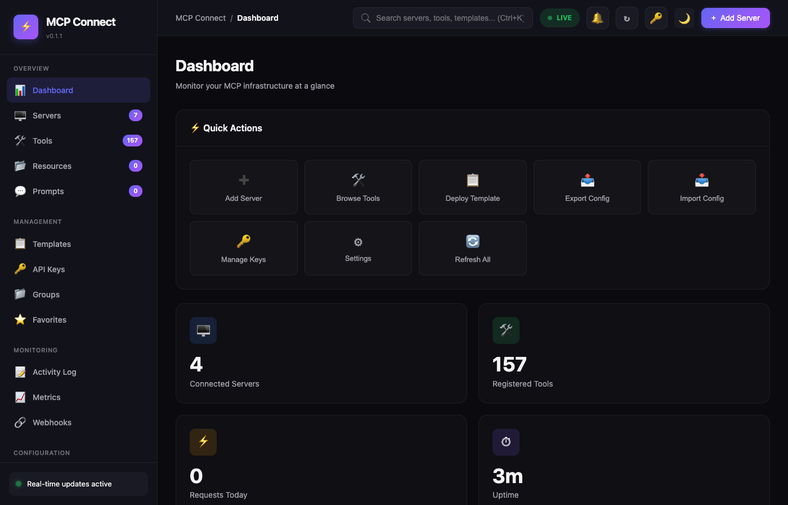
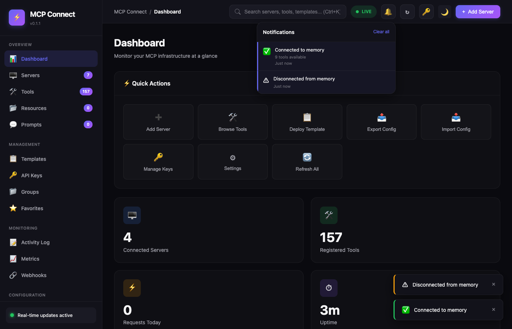
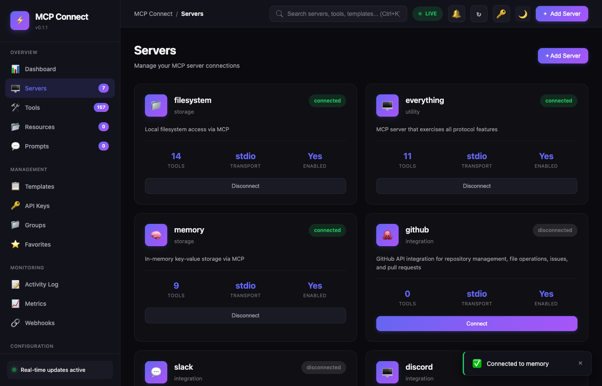
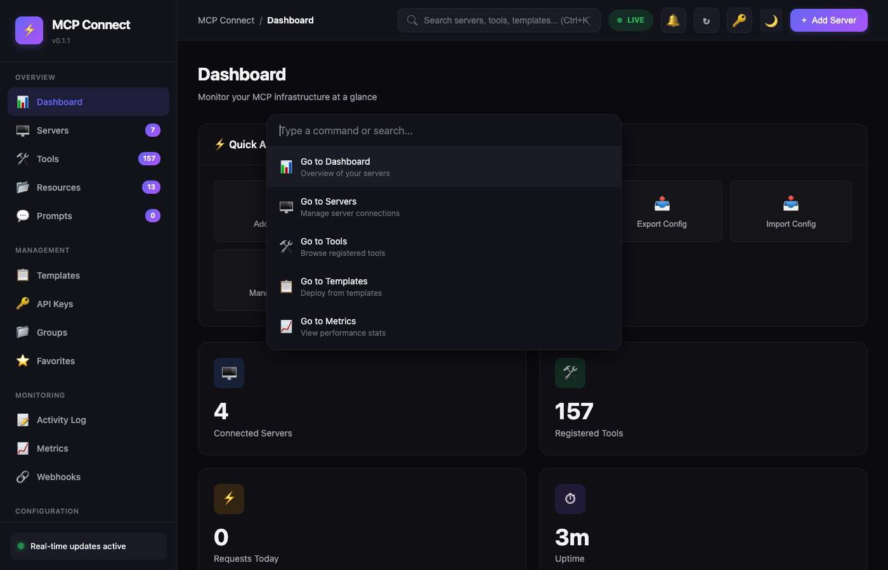
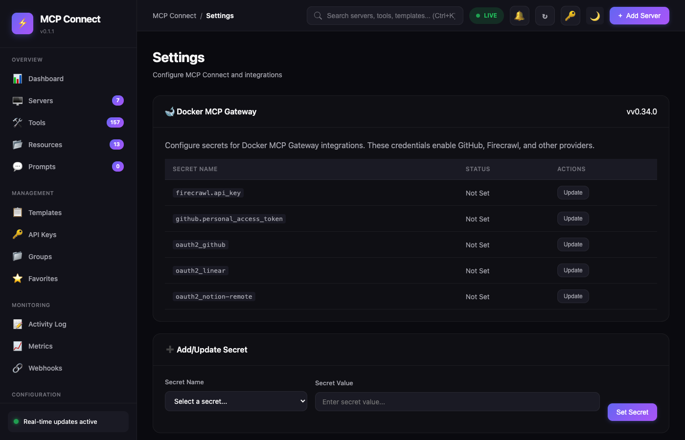
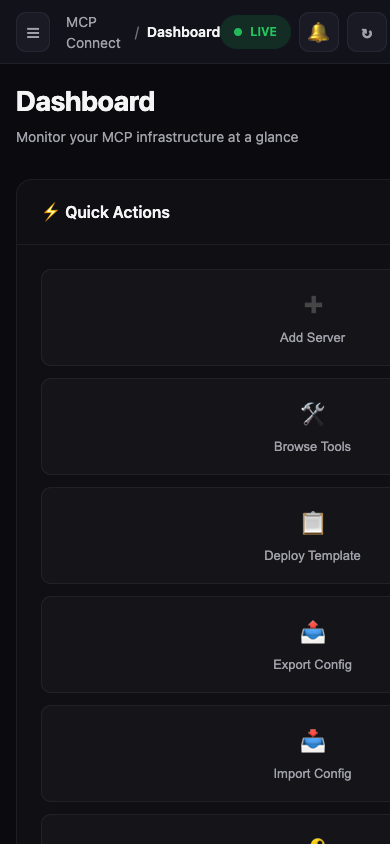
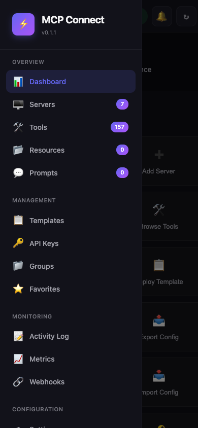

# MCP Connect

**Universal MCP Server Aggregator & Connection Manager**

A centralized hub that aggregates multiple MCP (Model Context Protocol) servers into a single, unified API with a modern dashboard for management and monitoring.

  

## Screenshots

### Dashboard


### Real-time Notifications


### Server Management


### Performance Metrics


### Command Palette (Ctrl+K)


### Docker MCP Gateway Settings


### Mobile Responsive
<p float="left">
  
  
</p>

## Features

### Core Capabilities
- **Connection Pool Management** - Automatic connection handling with health checks and reconnection
- **Tool Registry** - Unified registry of all tools from connected MCP servers
- **Resource & Prompt Discovery** - Automatic discovery and registration of MCP resources and prompts
- **Tool Router** - Route tool invocations to the correct server with caching
- **Docker MCP Gateway** - Native integration with Docker's MCP Gateway for 100+ tools

### Dashboard
- **Real-time Monitoring** - Live server status, tool counts, and request metrics
- **Quick Actions** - One-click server management, config export/import
- **Notifications Panel** - SSE-powered real-time event notifications
- **Command Palette** - Keyboard-driven navigation (Ctrl+K)
- **Performance Charts** - Response time and request distribution visualization
- **Mobile Responsive** - Full functionality on phones and tablets

### Enterprise Features
- **API Key Management** - Scoped permissions with expiry
- **Rate Limiting** - Per-server and per-key rate limits
- **Circuit Breaker** - Automatic failure detection and recovery
- **Audit Logging** - Complete request and action audit trail
- **RBAC** - Role-based access control
- **Multi-tenancy** - Tenant isolation support
- **Webhooks** - Event subscriptions with delivery tracking

## Quick Start

```bash
# Clone the repository
git clone https://github.com/ryanhalphide/mcp-connect.git
cd mcp-connect

# Install dependencies
npm install

# Create data directory
mkdir -p data

# Start development server
npm run dev
```

Open http://localhost:3000 to access the dashboard.

## Dashboard Pages

| Page | Description |
|------|-------------|
| **Dashboard** | Overview with quick actions, stats, and activity feed |
| **Servers** | Manage MCP server connections (connect/disconnect/edit) |
| **Tools** | Browse and invoke 157+ registered tools |
| **Resources** | Browse MCP resources from connected servers |
| **Prompts** | View and test MCP prompts |
| **Templates** | Deploy servers from pre-built templates |
| **API Keys** | Create and manage API keys with scopes |
| **Metrics** | Performance charts and request statistics |
| **Activity Log** | Real-time event stream |
| **Settings** | Docker MCP Gateway secret configuration |

## API Endpoints

### Authentication
All API endpoints (except health) require authentication via API key:
```bash
Authorization: Bearer YOUR_API_KEY
```

### Servers
```bash
GET    /api/servers              # List all servers
POST   /api/servers              # Create a server
GET    /api/servers/:id          # Get server details
PUT    /api/servers/:id          # Update server
DELETE /api/servers/:id          # Delete server
POST   /api/servers/:id/connect  # Connect to server
POST   /api/servers/:id/disconnect # Disconnect from server
POST   /api/servers/bulk/connect    # Bulk connect
POST   /api/servers/bulk/disconnect # Bulk disconnect
```

### Tools
```bash
GET    /api/tools                # List all tools
GET    /api/tools?q=search       # Search tools
GET    /api/tools/:name          # Get tool details
POST   /api/tools/:name/invoke   # Invoke a tool
POST   /api/tools/batch          # Batch invoke tools
```

### Resources & Prompts
```bash
GET    /api/resources            # List all resources
GET    /api/resources/:uri       # Read a resource
GET    /api/prompts              # List all prompts
GET    /api/prompts/:name        # Get prompt details
POST   /api/prompts/:name/execute # Execute a prompt
```

### Real-time Events (SSE)
```bash
GET    /api/sse/events           # Subscribe to SSE events
GET    /api/sse/status           # Get SSE connection status
```

Event types: `server.connected`, `server.disconnected`, `server.error`, `tool.invoked`, `circuit.opened`, `circuit.closed`

### Health & Monitoring
```bash
GET    /api/health               # Full health status
GET    /api/health/live          # Liveness probe (K8s)
GET    /api/health/ready         # Readiness probe (K8s)
GET    /api/monitor/stats        # System statistics
GET    /api/monitor/dashboard    # Dashboard data
GET    /metrics                  # Prometheus metrics
```

### Docker MCP Gateway
```bash
GET    /api/docker/status        # Check Docker MCP availability
GET    /api/docker/secrets       # List configured secrets
POST   /api/docker/secrets       # Set a secret
DELETE /api/docker/secrets/:name # Remove a secret
GET    /api/docker/catalog       # List available servers
```

## Configuration

### Environment Variables
```bash
PORT=3000                    # Server port
DB_PATH=./data/mcp-connect.db # SQLite database path
LOG_LEVEL=info               # Logging level
NODE_ENV=development         # Environment
MASTER_API_KEY=xxx           # Master key for /api/keys endpoint
CORS_ORIGIN=*                # CORS allowed origins
```

### Adding an MCP Server

```bash
curl -X POST http://localhost:3000/api/servers \
  -H "Authorization: Bearer YOUR_API_KEY" \
  -H "Content-Type: application/json" \
  -d '{
    "name": "filesystem",
    "description": "Local filesystem access via MCP",
    "transport": {
      "type": "stdio",
      "command": "npx",
      "args": ["-y", "@modelcontextprotocol/server-filesystem", "/tmp"]
    },
    "enabled": true
  }'
```

### Docker MCP Gateway Integration

MCP Connect integrates with Docker's MCP Gateway for access to 100+ tools:

```bash
# Configure GitHub access
curl -X POST http://localhost:3000/api/docker/secrets \
  -H "Authorization: Bearer YOUR_API_KEY" \
  -H "Content-Type: application/json" \
  -d '{"name": "github.personal_access_token", "value": "ghp_xxx"}'
```

Available integrations: GitHub, Linear, Notion, Slack, Firecrawl, and more.

## Architecture

```
mcp-connect/
├── src/
│   ├── api/              # REST API routes
│   │   ├── servers.ts    # Server CRUD & connection
│   │   ├── tools.ts      # Tool discovery & invocation
│   │   ├── resources.ts  # Resource browsing
│   │   ├── prompts.ts    # Prompt management
│   │   ├── sse.ts        # Server-sent events
│   │   ├── docker.ts     # Docker MCP Gateway
│   │   └── health.ts     # Health endpoints
│   ├── core/             # Business logic
│   │   ├── pool.ts       # Connection pool
│   │   ├── registry.ts   # Tool registry
│   │   ├── events.ts     # Event emitter
│   │   ├── rateLimiter.ts
│   │   └── circuitBreaker.ts
│   ├── mcp/              # MCP client
│   │   └── client.ts     # SDK integration
│   ├── storage/          # Persistence
│   │   └── db.ts         # SQLite + migrations
│   ├── rbac/             # Access control
│   ├── observability/    # Logging & metrics
│   └── index.ts          # Entry point
├── public/               # Dashboard UI
│   └── index.html        # Single-page app
├── config/               # Server templates
└── data/                 # SQLite database
```

## Tech Stack

- **Runtime**: Node.js 18+
- **Framework**: Hono (fast web framework)
- **Database**: SQLite with better-sqlite3
- **MCP SDK**: @modelcontextprotocol/sdk
- **Validation**: Zod
- **Logging**: Pino
- **Charts**: Chart.js
- **Styling**: Custom CSS with CSS variables

## Keyboard Shortcuts

| Shortcut | Action |
|----------|--------|
| `Ctrl+K` / `Cmd+K` | Open command palette |
| `1-5` | Quick navigation (Dashboard, Servers, Tools, Templates, Metrics) |
| `Escape` | Close modals/palette |

## Development

```bash
# Development with hot reload
npm run dev

# Type checking
npm run typecheck

# Linting
npm run lint

# Build for production
npm run build

# Start production server
npm start
```

## Deployment

### Railway (Recommended)
```bash
# Install Railway CLI
npm install -g @railway/cli

# Login and deploy
railway login
railway init
railway up
```

### Docker
```bash
docker build -t mcp-connect .
docker run -p 3000:3000 -v ./data:/app/data mcp-connect
```

## License

MIT

---

Built with Claude Code
